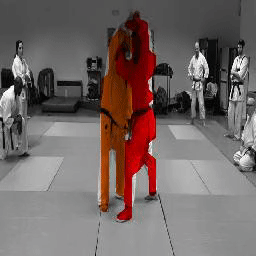

# Tracking via Colorization



To understand the concepts read this blog.


## Introduction 
This is a pytorch implementation of [Tracking Emerges by Colorizing Videos](https://arxiv.org/abs/1806.09594), a self supervised tracking model.


## How to use

### Training

>Use the [config](/src/config.py) file to setup the hyperparameters for the training

* **Clustering**
```
  # modify these config for image quantisations keep KMEANS_FILE=None for 1st run,
  # for next run you can reuse the created file
    KMEANS_FILE = None
    CLUSTERS = 16
    CHANNELS = 'lab'
    QUANTIZE_CHANNELS = (1,2)
    KMEANS_SAMPLES = 100000
    KMEANS_REFIT = False
```

* **train**
```
python train.py
```

### Model logging
>In this experiment we have used [wandb](https://app.wandb.ai/) to plot model metrics and intermediate outputs, you can have a quick start [here](https://docs.wandb.com/quickstart).
>Create an account and start using this by setting your api key.
```
export WANDB_KEY= <your api key>
``` 
>and then change `WANDB=True` in [config](/src/config.py)
```
 WANDB = False
 WANDB_LOG_ROOT = "./logs/model"
 __WANDB_KEY = os.getenv("WANDB_KEY")
```

### TODO
>You can start training your model with this code but it is still in WIP phase

- [ ] Add requirements.txt
- [ ] Add testing set loss during training
- [ ] Add more model metrics 
- [ ] Create tracking inference code  
- [ ] Create image up-sampling logic for precise mask prediction
